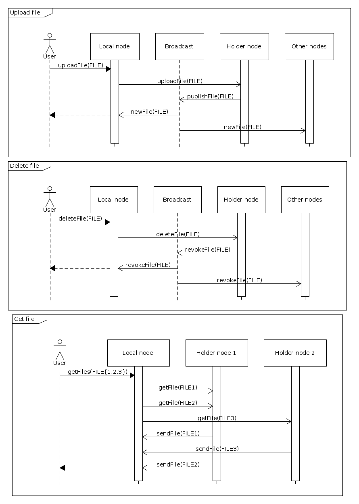

# p2p_FileDistributor

## 2) Interpretacja i doprecyzowanie treści
- Plik jest identyfikowany nazwą oraz hashem (MD5), jednak sam hash nie jest wykorzystywany do innego celu niż identyfikacja pliku (mapowanie h >> n jest nie do końca intuicyjne, bo: adresy IP mogą być nieciągłe oraz mogą zostawiać dowolne, nieprzewidziane odległości między sobą w przypadku odłączania węzłów). Informacja o węźle przetrzymującym plik będzie zawarta w deskryptorze pliku. Jego głównym wyróżnikiem jest hash MD5 - dopóki hashe są różne - pliki mogą mieć takie same nazwy.

## 3) Krótki opis funkcjonalny
### Dystrybucja zasobów
- Węzęł dołączający się do sieci wysyła jedynie informację o swoim pojawieniu się poprzez Broadcast - pozostałe węzły sieci wysyłają	 informacje o plikach, które u siebie przechowują poprzez bezpośrednie połączenie z nowym węzłem. Po tym dopiero następuje redestrybucja zasobów (przesłanie części własnych plików do nowego węzła).
- Węzeł dystrybuujący swój zasób oznacza go jako tymczasowo nieważny i rozsyła tę informację do wszystkich węzłów sieci. Po tym wykonuje transmisję oznaczonego zasobu do węzła przyjmującego pliki, który dopiero po prawidłowym odebraniu pliku - rozgłasza nowy deskryptor pliku (ze zmienionym węzłem przechowującym), już z flagą aktualności.
- Węzły przechowują zasoby w plikach o nazwach równym ich hashowi MD5 (umożliwia to przechowywanie przez jeden węzeł 2 deskryptorów o tej samej nazwie).

### Strategia dystrybucji
- Miejsce składowania nowego pliku jest wybierane przed jego pojawieniem się w sieci na podstawie obciążenia węzłów (po sumarycznym rozmiarze przechowywanych plików). Po poprawnej transmisji (jeśli taka była potrzebna - sytuacja, że wybrany węzeł przechowujący != właściciela) węzeł, który odebrał plik rozgłasza jego pojawienie się w sieci.
- Po dołączeniu się nowego węzła następuje rebalansowanie sieci. Jeśli jakiś węzeł przechowuje u siebie więcej zasobów niż oczekiwana średnia - przesyła tę nadwyżkę (zaokrąglając do całych plików) do nowego węzła.

### Realizacja interfejsu węzła
- Usunięcie pliku z sieci (unieważnienie przez właściciela) opiera się na wysłaniu bezpośredniego żądania usunięcia pliku do węzła, który ten plik aktualnie przechowuje. Oznacza on ten plik jako "usunięty" i rozsyła tę informację po całej sieci. Wtedy każdy z węzłów jest zobligowany do usunięcia deskryptora danego pliku ze swojej listy. Jeśli trwają jeszcze jakieś transmisje - węzeł wysyłający żądanie usunięcia pliku na to nie pozwoli.
- Poprawne odłączenie się węzła opiera się na: rozgłoszeniu informacji w sieci o rozpoczęciu procedury odłączenia (zapobiegnie to sytuacji, kiedy w momencie "opróżniania" węzła powstaną nowe pliki, które zostałyby do niego przesłane), oznaczenia wszystkich przechowywanych zasobów jako "tymczasowo nieważnych" oraz ich redestrybucji do pozostałych węzłów sieci (które po odebraniu zasobów ponownie rozgłoszą ich aktualne deskryptory). Po zakończeniu tych operacji węzeł wysyła ostatni broadcast "SHUTDOWN", który ostatecznie sygnalizuje, że węzeł przestał istnieć.

### Sytuacje wyjątkowe
- Zaniknięcie węzła - w przypadku, jeśli węzeł zakończył pracę nieprawidłowo, to przy pierwszej próbie połączenia przez którykolwiek z węzłów informacja o tym zostanie rozgłoszona po sieci - wtedy każdy z węzłów usunie z własnej listy deskryptorów te wpisy, których zasoby które znajdowały się na usuniętym węźle. Wszystkie ewentualne transmisje zwrócą błędy, a jeśli będzie to możliwe - odwrócą jak najwięcej szkód. Pliki, których właścicielem był utracony węzeł nie zostają usunięte (jeśli komunikacja z węzłem zostanie ponowiona - zasoby dalej będą dostępne).
- Konflikt nazw - nie występuje. Jeśli taka sytuacja nastąpi, to CLI wyświetli oba pliki wraz z fragmentem ich hasha i poprosi o wprowadzenie komendy rozszerzonej (nazwa + hash pliku).
- Konflikt hashy - przypadek, kiedy ten sam plik został zuploadowany przed propagacją informacji o poprzednio dodanym pliku. Wtedy każdy z węzłów automatycznie usuwa deskryptor pliku, który miał późniejszy "uploadTime". Jeśli czasy uploadu są takie same - wybranie zostanie deskryptor z nazwą leksykograficznie mniejszą (zawartość plików jest wtedy taka sama, więc w żaden sposób nie tracimy wtedy żadnej informacji).

## 4) Opis i analiza protokołów komunikacyjnych
### Opis komunikatów
Przesyłane wiadomości są opatrzone typem wiadomości (dołączenie do sieci, rozgłoszenie deskryptora, przesłanie pliku etc.) oraz rozmiarem danych, znajdujących się tuż za końcem struktury (mogą nimi być już deskryptory lub całe pliki). Typ danych znajdujących się za strukturą P2PMessage jest definiowany jednoznacznie przez typ wiadomości.
```c
struct P2PMessage {
	MessageType messageType;
	uint32_t additionalDataSize;
};
```

### Typy komunikatów
Komunikaty oznaczone jako UDP będą broadcastowane w sieci. Oznaczone jako TCP - będą przesyłane bezpośrednio do określonego węzła.
```c
enum class MessageType {
	// raportowanie stanu
	HELLO,			// UDP komunikat wysyłany przez nowoutworzony węzeł
	HELLO_REPLY,		// TCP odpowiedź od węzłów, które usłyszały HELLO. Dołącza tablicę deskryptorów plików, które znajdowały się w danej chwili w konkretnym 
	DISCONNECTING,		// UDP powiadomienie sieci o rozpoczęciu odłączania się
	CONNECTION_LOST,	// UDP powiadomienie sieci o utraceniu węzła o określonym IP (podanym w sekcji danych)
	CMD_REFUSED,		// TCP powiadomienie węzła, który złożył żądanie (np. o pobranie pliku) o braku możliwości wykonania transkacji (np. dostęp do pliku oznaczonego jako "tymczasowo nieważny" albo próba przesłania pliku do węzła w stanie "disconnecting")
   	SHUTDOWN,           	// UDP ostatnia wiadomość wysyłana przez zamykający się węzeł - ostatecznie usuwa wszystkie deskryptory, ktore nadal nie zostaly zaktualizowane
	
	// zarządzanie plikami
	NEW_FILE,		// UDP powiadomienie sieci o nowym pliku o danym deskryptorze (podanym w sekcji danych)
	REVOKE_FILE,		// UDP powiadomienie sieci o usunięciu pliku o danym deskryptorze (podanym w sekcji danych)
	DISCARD_DESCRIPTOR,	// UDP oznacz podany deskryptor jako "tymczasowo nieważny"
	UPDATE_DESCRIPTOR,	// UDP rozgłoś nową wersję deskryptora (wcześniej oznaczonego jako "tymczasowo nieważny")
	HOLDER_CHANGE,		// TCP przesłanie do określonego węzła zaktualizowanego deskryptora (wcześniej oznaczonego jako "tymczasowo nieważny") oraz pliku
	FILE_TRANSFER,		// TCP przesłanie deskryptora oraz zawartości pliku do węzła, który wcześniej tego zażądał
	
	// interfejs użytkownika
	UPLOAD_FILE,		// TCP żądanie uploadu pliku, zawiera w sekcji danych: deskryptor oraz plik (jako tablica bajtów)
	GET_FILE,		// TCP żądanie przesłania pliku o danym deskryptorze (podanym w sekcji danych) od węzła przetrzymującego plik
	DELETE_FILE,		// TCP żądanie unieważnienia pliku o danym deskryptorze (podanym w sekcji danych) do węzła przetrzymującego plik
};
```

### Deskryptor pliku
Struktura, która jest dystrybuowana w sieci i definiuje pozycję i właściciela każdego pliku. Jej unikalnym polem jest hash MD5.
```c
struct FileDescriptor {
	char[33] md5;
	char name[256];
	uint32_t size;
	clock_t uploadTime;
	uint32_t ownerIp;
	uint32_t holderIp;
	bool valid;
};
```

### Zależności czasowe




## 5) Moduły i realizacja współbieżności
### Moduły
1. Moduł węzła obsługujący protokół.
2. Moduł procesora wiadomości sieciowych (właściwej implementacji protokołu).
3. Moduł obsługi sieci (serwera TCP oraz gniazda UDP).
4. Moduł obsługi wielowątkowości (opakowanie pthreads).
5. CLI komunikujące się z API modułu węzła.
6. Moduł thread-safe loggera.

### Realizacja współbieżności
Proces początkowy realizuje obsługę interfejsu użytkownika oraz startuje osobny wątek do obsługi węzła sieci P2P. Wątek węzła uruchamia wątki odpowiedzialne za nasłuchiwanie broadcastu oraz obsługę serwera TCP. W tych wątkach znowuż po odebraniu wiadomości (w nasłuchu UDP) lub nawiązaniu połączenia (serwer TCP) zostaną powołane kolejne wątki, obsługujące już pojedyncze połączenie/pakiet. Przetwarzają je i aktualizują struktury opisujące węzeł.


## 6) Interfejs użytkownika
Interfejs użytkownika implementuje podstawowe akcje do wykonania w stosunku do sieci.
```
Available commands:
1. connect
2. disconnect
3. upload <filenames>
4. delete <filenames>
5. deletemd5 <filenames> <md5>
6. get <filenames>
7. getmd5 <filenames> <md5>
8. saf (show all files in network)
9. slf (show local files)
10. help
```

- `connect`/`disconnect` nawiązuje/kończy sesję P2P w sieci,
- `upload` uploaduje plik do sieci (miejsce jego fizycznego składowania zostanie przydzielone automatycznie). Można podać jednocześnie kilka plików (oddzielonych spacją),
- `delete` usuwa plik z sieci (ale tylko, jeśli wydającym komendę usunięcia jest jego właściciel). Można podać jednocześnie kilka plików (oddzielonych spacją),
- `get` pobiera plik z sieci (samoczynnie odnajduje węzeł przechowujący). Można podać jednocześnie kilka plików (oddzielonych spacją),
- `saf` listuje pliki znajdujące się w sieci,
- `slf` listuje pliki przechowywane w tym węźle.

Wersje z dodatkowym hashem MD5 są konieczne tylko w przypadku, kiedy wybraliśmy plik, który posiada swoje odpowiedniki o tych samych nazwach (ale różnej zawartości!). W takim wypadku interfejs sam poprosi nas o użycie odpowiedniej komendy.
Ścieżki do plików są rozwijane względem katalogu uruchomienia głównej binarki.

## 7) Postać logów i plików konfiguracyjnych
Projekt nie wymagał użycia dodatkowych plików konfiguracyjnych. Dopóki istnieje choć jeden węzeł, dopóty informacja o stanie całej sieci pozostaje kompletna. Aplikacja wykorzystuje bibliotekę logów `boost`, które przyjmują postać:

```
[2018-01-20 15:41:08.194663] [0x00007fcaf464d740] [debug]   >>> HELLO: joining to network
[2018-01-20 15:41:08.196897] [0x00007fcaf1299700] [debug]   <<< HELLO_REPLY from: 192.168.0.102 0 descriptors received
upload md5coll1 md5coll2
[2018-01-20 15:42:44.910745] [0x00007fcaf464d740] [debug]   ===> UploadFile: md5coll1 saved in node 192.168.0.102
[2018-01-20 15:42:44.913433] [0x00007fcaf464d740] [debug]   ===> UploadFile: md5coll2 saved in node 192.168.0.102
[2018-01-20 15:42:44.915365] [0x00007fcaf1299700] [debug]   <<< NEW_FILE: md5coll1 md5: 6a5985f9058b4ab5b2a464004ca0f24e in node: 192.168.0.102
[2018-01-20 15:42:44.919717] [0x00007fcaf1299700] [debug]   <<< NEW_FILE: hashes collision! md5coll1 and md5coll2 md5: 6a5985f9058b4ab5b2a464004ca0f24e upload times (old, new): 1516491764 vs 1516491764; earlier file choosen (or with < filename)
```

Naszym priorytetem było bardzo dokładne prowadzenie logów z pracy całego protokołu (bardzo uprościło to debugowanie). Każdy typ wiadomości (wyspecyfikowane w `MessageTypes`) posiada przynajmniej 1 własny log (a w przypadku bardziej złożonych nawet po 3-4 warianty - zależnie od aktualnego stanu rzeczy).

Logi rozpoczynające się od:
- `>>> [type]` oznaczają, że nadajemy wiadomość o takim `MessageType`,
- `<<< [type]` oznaczają odebranie analogicznej wiadomości,
- `===> [type]` oznaczają wysłanie żądania od użytkownika (jak upload, pobranie czy usunięcie pliku).

## 8) Opis wykorzystanych narzędzi
Użyliśmy:
- `C++14`: obsługa przesyłanych komunikatów (np. `<vector>` używane w postaci buforów), sprytne wskaźniki (opóźnione instancjonowanie serwerów TCP i UDP) oraz w strukturze procesorów wiadomości (`<functional>`):
```c++
void p2p::util::processTcpMsg(uint8_t *data, uint32_t size, SocketOperation operation) {
    P2PMessage &p2pMessage = *(P2PMessage *) data;
    [...]
    
    msgProcessors.at(messageType)(additionalData, additionalDataSize, operation.connectionAddr);
}

msgProcessors[MessageType::HELLO] = [](const uint8_t *data, uint32_t size, in_addr_t sourceAddress) {
   // process HELLO broadcast received in this node
}
```
- `boost`: unit-testy, zbierania logów. 
- `POSIX`: obsługa współbieżności (threads, mutexes), a do obsługi sieci - gniazda BSD.

## 9) Opis testów i ich wyników
Testowaliśmy aplikację na 2 sposoby.

### Unit testy
Dla fragmentów, które na to pozwalały (takie jak np. wyliczanie hasha MD5, obsługa serwerów TCP i UDP, testowanie klas pomocniczych zarządzania plikami etc.) przeprowadzaliśmy wiele testów jednostkowych, co efektywnie przyśpieszyło rozwój samej implementacji protokołu (mając pewność co do poprawności używanych modułów aplikacji).

### Testy protokołu
Zestawiliśmy ze sobą kilka maszyn wirtualnych połączonych bezpośrednim mostkiem do interfejsu sieciowego. Na docelowej konfiguracji testy przeprowadzane były na:

- PC1: 4 maszyny wirtualne z Ubuntu 16.04 (PC podłączony po WiFi do sieci lokalnej)
- PC2: 1 maszyna wirtualna z Ubuntu 16.04 (PC podłączony przez Ethernet)
	
#### Broadcasty UDP
W takiej konfiguracji czasami występowały już problemy w dostarczaniu broadcastów do wszystkich węzłów. Sieć w wielu miejscach stara się odbudowywać w miarę możliwości utracone informacje (każda zmiana stanu jakiegoś deskryptora jest kolejną szansą na jego dotarcie do wszystkich węzłów). 

Ich skutkiem była zdesynchronizowana baza deskryptorów sieciowych. Jednak nie powodowała ona całkowitego zniszczenia sieci (jeśli np. próbowalibyśmy się dostać do zasobu nieaktualnego, to węzeł odbiorczy sam odmówił przeprowadzenia transakcji - komenda CMD_REFUSED).

#### Hazardy wersji deskryptorów
Od czasu do czasu udawało się nam również doprowadzać do skrajnego hazardu deskryptorów (log z tej sytuacji w punkcie **7) Postać logów i plików konfiguracyjnych**) - kiedy 2 pliki o różnej nazwie mają ten sam hash MD5 i nie zostało to wychwycone przez funkcję `uploadFile()`. Przystępujemy wtedy do odrzucenia deskryptora utworzonego później. 

Jednak ten przypadek był jeszcze bardziej złośliwy - nawet czasy uploadu były jednakowe. Błędem byłoby wzięcie dowolnego z pary skonfliktowanych deskryptorów - wtedy wiele węzłów mogłoby mieć ten sam fizycznie plik przechowywany pod różnymi nazwami (co po chwili doprowadziłoby do zduplikowania tego deskryptora przy dowolnej próbie przeniesienia czy uaktualnienia tego zasobu) - co też się na początku wydarzyło. 

Przyjęliśmy, że zawsze wybierzemy wtedy nazwę leksykograficznie mniejszą. Dzięki temu nie zachodziły kolejne niejednoznaczności w sieci.
